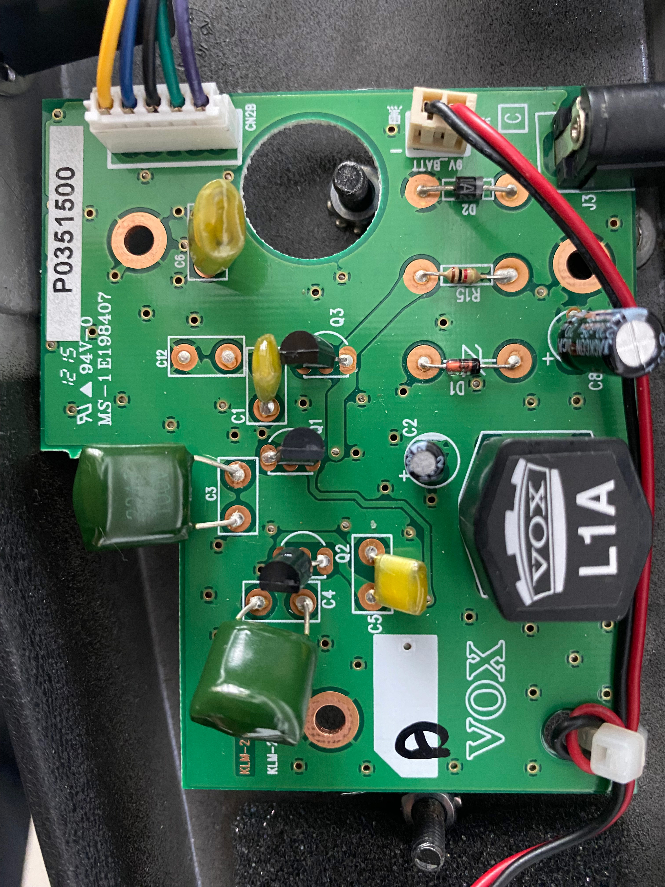
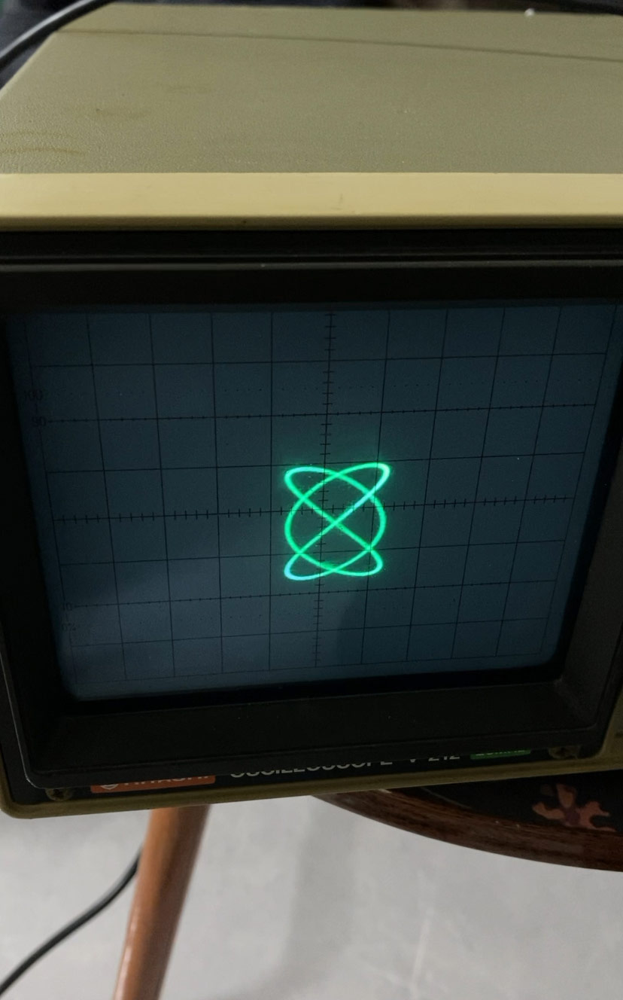

## 开始

寒假开始，大概是一月中旬，我用考前自己出的极高命中率**预测卷**以及**快速默写**，了结了数分考试，美美回家。

## 课题

在返程前，我给自己了几个课题，开拓我的舒适区。

* 硬件，如果有平行世界，那么中心束的我肯定玩硬件。我有种感觉：这玩意我**早该**会了、我本来就**应该**会，现在不会只是我忘了。
也许这就是理工男的**身份锚点**吧（，为此我在寒假前就做了些准备：
  * 学了点模电的知识，了解放大电路、三极管、PN结。
  * 安装了 LTspice、Multisim 并学了后者的基本操作，复写了 V847 Wah 音踏板的电路图。

目标是修好我那个用了没几次就坏，原价买的 Wah 音踏板，我有万用表、寒假期间还淘了模拟示波器，结合电路图我就可以准确排查PCB上那一块有问题，该换换、该修修。

出师未捷身先死，回到家以后，我翻开 Wah 音踏板，发现我这个和原版电路不一样，是改进过后的 V847 A 型，之前用 Multisim 画的电路图也对不上，多了放大电路、电位器也做了分板处理。苦于我的水平不能把PCB转换为电路图（双层板有铜桥），我在折腾了几夜以后，无奈和自己和解了（（ 等暑假的

虽然感觉结构挺简单的，但是我还是不会画电路图。。

* 示波器音乐，之前看B站那个纯律、平均律的对比，就挺感兴趣。原理其实很简单，X、Y轴分别两个输入，即可得到关于时间的参数方程进而得到图像。为此我去做了准备：
  * 在网上淘了好久模拟示波器，各种对比抉择，和不同卖家接触，有个卖家卖的价格不错，但是也不细看我发的消息，等了半个月都不发货，搞得我心灰意冷。。
  * 搞到 OsciStudio 的老版本，学习了基本内容，自己做了一些纯律的李萨如图以及变换。

在我回到家以后，我换了个卖家，可能是我天天盯着咸鱼吧，找到一个专业倒爷，他卖的是一个从学校/医院实验室退役的日立 V-212 型模拟示波器，品相非常好，倒爷也专业，很快就拿到货了。

经过一番折腾，把示波器旋钮老化等问题解决以后，校准了示波器，完全能用抗打。不过有一个问题就是我的独立声卡的左右输出声道有点坏了。我想到的解决方法很直接，用我的罗兰 FP-30X 电钢当USB声卡，总结一下就是如下链路：
$$
\text{电脑}\to \text{电钢 L/R} \to \text{示波器}
$$
上面是显示链路。
$$
\text{电脑}\to \text{电钢 耳机单声道} \to \text{马勺}
$$
上面这是音频链路。

然后就得到了：

由于电钢做前级，还可以玩点不一样的，当弹电钢上的琴键时，李萨如图会发生果冻般的弹动。

后来我在油管发现示波器音乐的“大本营”，结合软效果器、数学本质，那些人真是玩出花了，我大概会花时间去研究这玩意，太好玩了。

## 开坑

除了我上面提到的两个课题，我在寒假解锁、开坑了：嵌入式、无线电、逆向、桐油、硬件、博客等等领域，几乎两天一小项目，三天一大项目的进度完结了寒假，总之我会陆续把我做的项目写到博客里的。