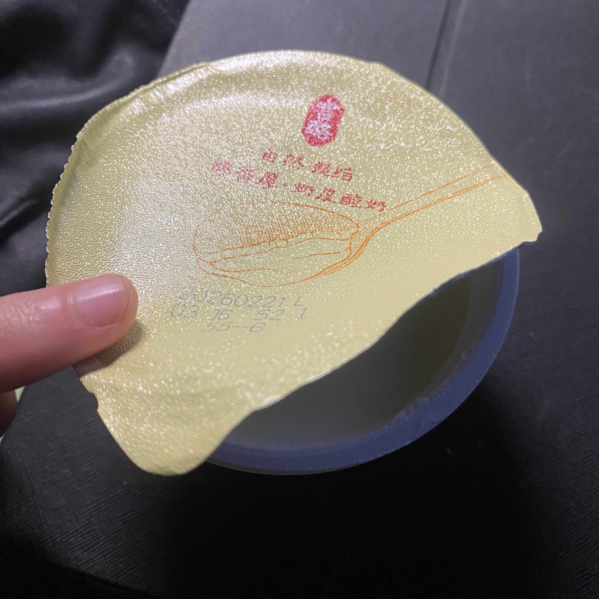

今天是星期五，完成了一天的课程，下午练练腿。

## 滑板

上周日体重还是57kg，经过我不懈努力，控制热量盈余，终于在今天把体重拉到60kg，可能是我喝肌酸了，往肌肉里狂灌水，我简直就是一个**海绵宝宝**。

下午的计划本来是练练腿的，但今天气温回暖，感觉还不错，我就想复健复健滑板。

去滑了一个小时，练了下滑行、Ollie、Manuel啥的，和上学期55kg的时候滑是有点不一样，感觉更稳了一点点，但是太久没练，跳不起来了（（（



## 吃

滑板完后，带了两个鸡蛋、一个馒头回去。

在寝室又翻到这个：

之前从 H 那**抢**来的。

入口比北京的奶皮子要稠，我也挺喜欢这种感觉的。

有时就觉得，有这么一个朋友挺好的。幸福感爆了，皮质醇降低，直接昏倒在床上深度睡眠。

本来想述说我这幸福感的，时机啊，差之毫厘，谬以千里。



