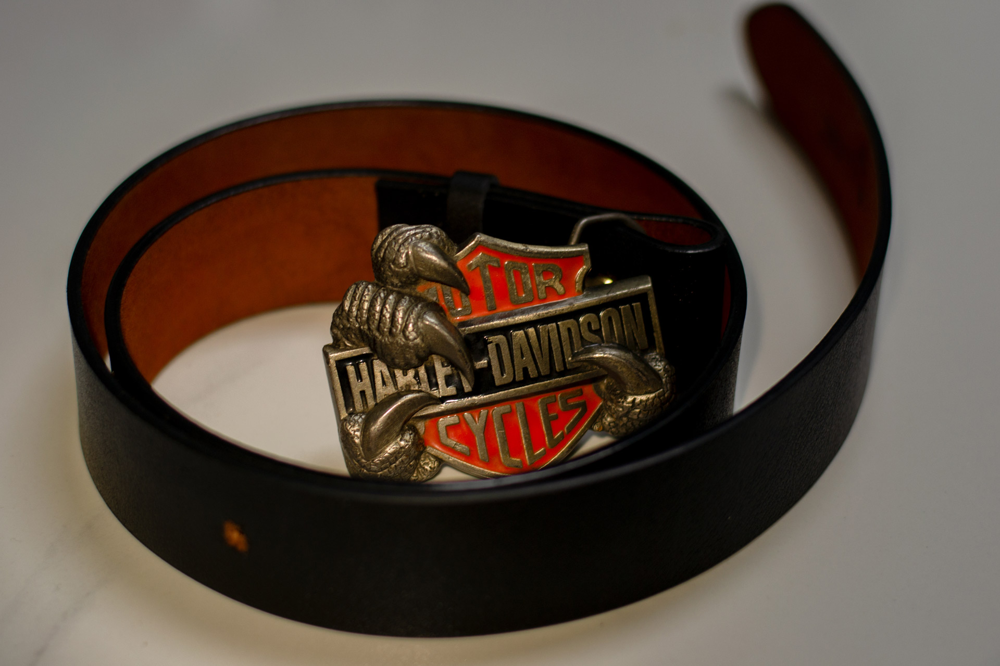
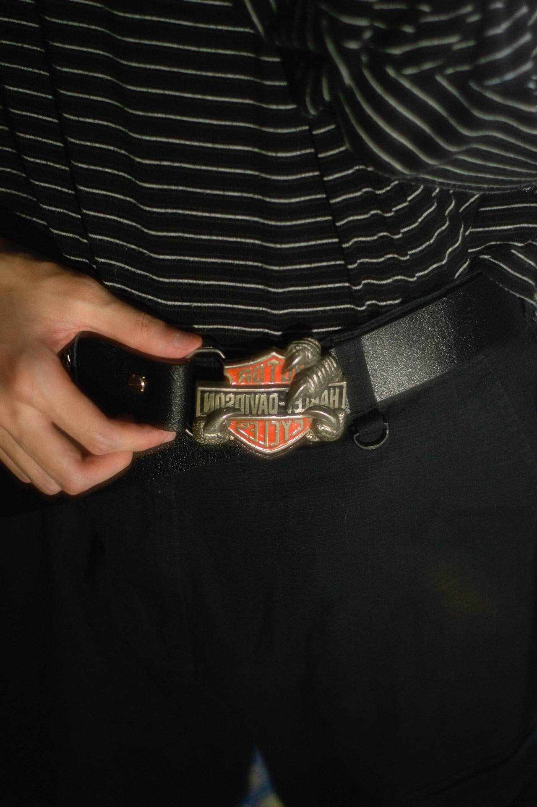
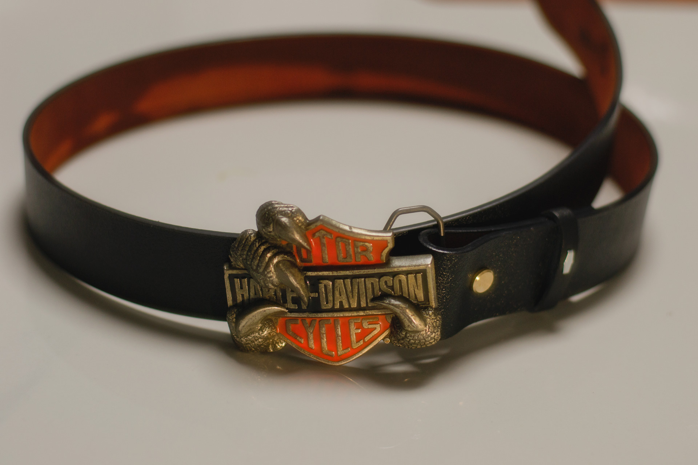

## 前言

哈雷1991年的一个板扣，我记得应该是初中，从我爸那得来的。一直存放在我的小盒子里，直到前几天和朋友聊天才想起来这个玩意儿，我转念一想，为啥我不能自己 DIY 一个皮带呢？这么好的材料不用岂不是浪费了。

## 准备

上网去学了皮带的结构，了解到这是板扣，以及组装所需要的材料：一根皮带、柳钉、板扣，还有一个打孔器。

由于这是不持续投入，我不打算大额投入，整理的购买清单如下：

1. 牛背皮手工无牙无孔带条 3.7cm 宽 105cm 长
    * 31 RMB
2. 光柄打孔钳
    * 12.9 RMB
3. 平头黄铜螺丝柳钉 内高 8mm
    * 4.6 RMB

总成本：
$$
31+12.9+4.6=48.5 \leqslant 50
$$

## 开工

由于是春节期间，发货等了好久，在皮带没到的情况下选择 8mm 内高的柳钉，有太短或太长的风险，但好在最后有惊无险。

板扣皮带的结构很简单，皮带一侧穿过板扣，用柳钉固定，再往合适的位置打上孔洞即可，虽然纸上谈兵很简单，现实有非常多**踩坑**的地方，例如为了活动性要多预留一点、柳钉的位置和板扣的活动空间、孔洞的大小。

这个打孔废了我大部分力气，因为廉价的打孔钳只能靠杠杆施力，这个带条又是**牛背皮**（最紧密的部分），用两只手根本打不穿。

我的解决方案是，用打孔钳先打一个孔印，然后用小刀在孔印上左右旋转，直至打穿，当然这样做的弊端就是孔印有点丑（其中一面），一共打三个孔，打完给我累脱力了。。。

## 拍摄

装备：D3100、50定f1.8、FC11C (519A高显色灯珠)

如下：

  

穿搭：Nike SB 裤、孤品皮带、黑底白细纹长衫。

通过法式塞能更明显展示哈雷。

> 这张咋感觉像 Choker ?

现在腰围太细了 (178 55kg)，~~长胖了肯定还要打孔~~。

多出来的那节也就 20cm+ ，我觉得正好，挺有感觉的。